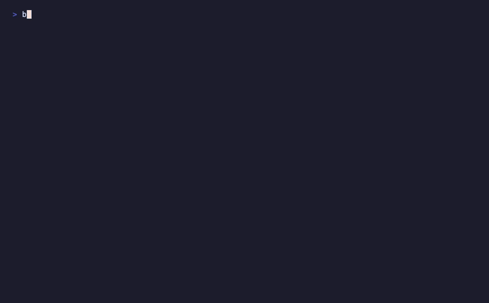

# claude-code-rootcause

**Your AI keeps making the same mistake. Adding another "don't do that" rule won't fix it.**

Two [Claude Code](https://claude.com/claude-code) skills for fixing the *cause* instead
of the symptom:

- **`/rethink`** — for when the agent makes a mistake and you're about to add a rule so
  it "won't happen again." It stops you from bolting another prohibition onto your
  instructions, and instead finds the root cause, converts the ban into a positive
  process, and routes it to the right layer.
- **`/deusex`** — for when a bug, system, or workflow has a structural flaw. It refuses
  to propose a fix until it has diagnosed the root, then redesigns so the problem
  can't recur.

Both share one rule: **never patch a symptom before you've found its structural cause.**

---



## Why this exists

The default loop for correcting an AI agent looks like this:

```
agent does something wrong
  → "add a rule: never do X"
  → agent later does Y (same cause, new surface)
  → "add a rule: never do Y"
  → instructions bloat, every request pays the context cost, root cause untouched
```

A negative rule is a one-time shield. It blocks one specific act and leaves the
category wide open. Do this for a few months and your `CLAUDE.md` is a graveyard of
"don't do this" notes that the model re-reads on every single request — and still
makes a cousin of the original mistake.

`/rethink` breaks the loop by converting *"never do B"* into *"before deciding, check
A and state the result"* — a gate that prevents the whole category, placed in the
narrowest layer that actually fixes it (a hook, a skill, a memory note — not always
your global instructions).

`/deusex` does the same for structures instead of instructions: diagnose to the root,
then redesign so the failure is impossible, not merely patched.

---

## The negative → positive idea (the core move)

| Reflex ban | What it leaks to | Positive process |
|---|---|---|
| "Never edit the wrong file" | edits a *different* wrong file | "State which file and why, confirm it matches the target, then proceed" |
| "Never guess dates" | guesses amounts, IDs, statuses | "Read values from the authoritative source; if absent, say so" |
| "Never over-complicate" | over-explains instead | "For a plain record request, act on the content only unless asked for more" |

The test for a good conversion: **would it also prevent the sibling mistakes you
haven't made yet?** If it only blocks the exact thing that just happened, it's still a
patch.

## Not just another root-cause analyzer

Plenty of skills do 5-whys / fishbone diagnosis. They stop at *"the cause is X."* This
goes three steps further, and that's the whole point:

| | 5-whys / RCA skills | rethink + deusex |
|---|---|---|
| Find the root cause | ✓ | ✓ |
| Convert the fix into a **positive gate** (not another ban) | — | ✓ |
| **Route** it to the right layer (hook / skill / memory / instructions) | — | ✓ |
| **Audit** the instruction file so it doesn't bloat with bans | — | ✓ |

That last row is measurable. `audit.py` (stdlib, no deps) counts the negative rules in
your `CLAUDE.md` and flags topics that already have several bans:

```bash
$ python3 ~/.claude/skills/rethink/audit.py CLAUDE.md
Negative rules found: 14
Topics with multiple bans (candidates to convert into one positive gate):
  3×  config
  2×  commit
```

A 5-whys skill diagnoses. This one is **instruction hygiene** — it keeps the file the
model re-reads on every request from rotting into a wall of "don't"s.

---

## Install

```bash
git clone https://github.com/<you>/claude-code-rootcause.git
cp -r claude-code-rootcause/skills/rethink ~/.claude/skills/rethink
cp -r claude-code-rootcause/skills/deusex  ~/.claude/skills/deusex
```

That's it — these are pure instruction skills. No dependencies, no scripts, no API
keys, nothing to authenticate.

---

## Usage

Invoke directly, or just describe the situation and let the skill trigger:

- `/rethink` — right after a correction, before you "add a rule"
- `"add a rule so you never do that again"` — triggers `/rethink` (which will *not*
  simply add the ban)
- `/deusex` — when the same bug keeps coming back
- `"fix this at the root, not another patch"` — triggers `/deusex`

> **Don't want to rely on remembering to type it?** Wire `/rethink` to a
> [Claude Code hook](https://docs.claude.com/en/docs/claude-code/hooks) so it fires
> automatically when a correction phrase ("add a rule", "never do that again",
> "remember not to…") appears in your prompt. That turns the methodology from
> voluntary self-policing into a deterministic gate — the skill's whole point is to
> route fixes to the layer that enforces them, and this is that layer for the skill
> itself.

### What `/rethink` does

1. **Root-cause analysis** — six questions; the two that matter are *why did it decide
   that?* and *what structural flaw does this reveal?*
2. **Negative → positive conversion** (hard gate) — abstract the mistake to a
   category, check it covers the sibling failures, rewrite as an enabling gate.
3. **Layer routing** — hook / new skill / existing skill / memory / project
   instructions / nothing. "Nowhere" is a valid outcome.
4. **Write + audit + log** — apply it, scan your instruction file for related bloat,
   record a one-line changelog entry.

### What `/deusex` does

1. **Diagnosis** (hard gate) — five questions, decompose the workflow into modules if
   needed, drill to the structural cause.
2. **Redesign** — before/after architecture, elegance check, side-effect check,
   entropy check (does the fix *lower* complexity?).
3. **Recurrence-impossibility proof** — one paragraph on why it can't happen again. If
   you can't write it, the fix isn't done.

---

## When to use which

| Situation | Skill |
|---|---|
| The *agent* misbehaved; you want to update how it works | `/rethink` |
| A *bug, system, or workflow* has a structural flaw | `/deusex` |
| You're about to type "never do X" into your instructions | `/rethink` first |
| You're tempted to "just make it work for now" | `/deusex` first |

They compose: `/rethink` Phase 1.5 can hand a structural problem to `/deusex`, and
`/deusex`'s diagnosis can end in a `/rethink` routing decision.

---

## License

MIT — see [LICENSE](LICENSE). Not affiliated with Anthropic.
